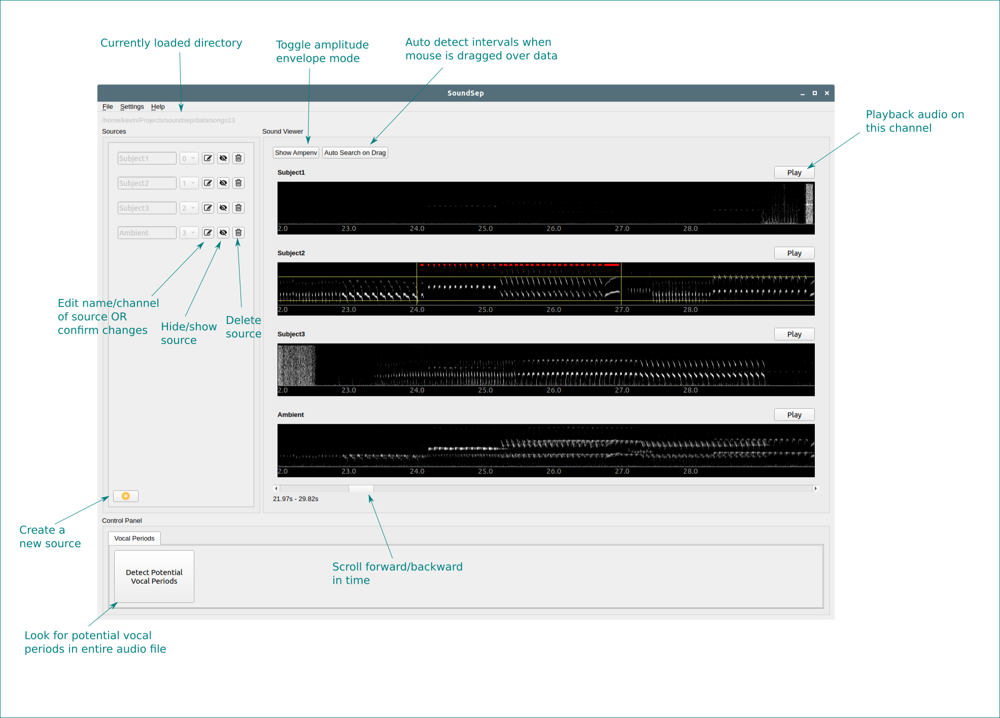
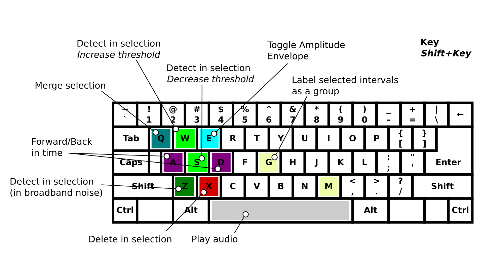

## Usage

This GUI is designed to make it easy to segment vocalizations across multiple channels from multiple experimental sources.



### Installation

#### Option 1: Installing from github

1. `git clone https://github.com/kevinyu/soundsep.git`

2. `cd soundsep`

3. `virtualenv env -p python3`

4. `source env/bin/activate`

5. `pip install -r requirements.txt`

#### Option 2.

1. Use an installer found at https://github.com/kevinyu/soundsep/releases

#### Troubleshooting

* If you haven't used them before, you may need to install git, pip, and virtualenv. On mac, install homebrew (https://brew.sh/) and then `brew install git`. Pip can be installed with `sudo -H python -m ensurepip`, and virtualenv can be installed via pip with `pip install virtualenv`.

* You may need to install PortAudio. On ubuntu: `sudo apt-get install libportaudio2`

* You may need to install Qt5 on ubuntu. `sudo apt-get install qt5-default`


### Starting the GUI

1. `source env/bin/activate`

2. `fbs run`


### Loading a file

This app reads audio files from a directory (make sure you are opening the containing directory, not a specific file). What they all have in common that you open a directory containing some organization of subdirectories, wav files, or other file formats. The code that determines how the data is read is located in `code/app/main.py`. These are the formats:

#### 1. Partial wav files, 1 channel per wav file

In this structure, each wav file only has one microphone channel. The recordings from each channel are separated into different directories, and each channel has the same number of wav files (marked by timestamp).
```
toplevel/
    ch0/
        [timestamp1].wav
        [timestamp2].wav
        ...
    ch1/
        [timestamp1].wav
        [timestamp2].wav
        ...
    ...
```

#### 2. Complete wav files, 1 channel per wav file

In this structure, each wav file only contains one channel of audio data, but each wav file actually spans the entire recording (continuous recording).

```
toplevel/
    ch0.wav
    ch1.wav
    ...
```

#### 3. Partial wav files with multiple channels per wav file

In this structure, there can be one or more wav files representing different time periods of audio, and each wav file contains 1+ channels of audio data.

```
toplevel/
    [timestamp0].wav
    [timestamp1].wav
    ...
```

#### 4. Songephys lazy loading

This format is specific to our songephys data pipeline, where audio data is written to disk as a numpy memmapped array and accessible with a pickled python object for reading the data (lazy.npy).

```
toplevel/
    lazy.npy
```

The toplevel directory here looks something like `data/[subject]/sites/[site]/` and the memmap arrays are located in `data/[subject]/sessions/*/raw/mic.memmap`.

### Setting up vocal sources

The application organizes the vocal period data by the concepts of "sources" (audio sources, which in our case are individual vocalizers) and "channels" (audio channels in the recording). For each source, the user maps it onto a channel that will be displayed for it (i.e., the microphone attached to that vocalizer, or pointing to that vocalizer). Multiple sources may be assigned to the same channel - they will display the same audio data and it is up to the user to distinguish the vocalizations from the two subjects.

To create add a source, click the orange (+) icon in the left panel. This should create a new row with a prefilled name and channel. Click the edit button to change the name of the source and the assigned channel, and click it again to confirm. The channel can be hidden with the middle button, or deleted with the trash can button.

### Data selection

An audio period can be selected by clicking and dragging on the spectrogram window.

When Amp Env view is on, you drag a threshold line across the amplitude envelope shown. When Amp Env view is off, you select a region of time-frequency space. This region is used to detect individual vocal intervals. Clicking again (not dragging) on the spectrogram will clear the current selection.

When a region is selected, you can right click for some basic options, or use the keyboard shortcuts described in the following section.

Note: If you are having a hard time getting intervals to be detected, try these:

* selecting a narrower / wider frequency range or time range in the normal view

* drawing threshold directly in the amp env view

* if there is a high noise floor, using `Z` in the normal view

* Using `Shift+W` and `Shift+S` to manually increase and decrease the amp env threshold

### Keyboard Shortcuts



The keyboard shortcuts in this are designed to have your left hand on the keyboard and your right hand on the mouse.

`A` and `D`: Move earlier and later in time

`W` and `S`: Automatically segment into calls (both do the same)

`Q`: Merge selected segments

`E`: Toggle between amplitude envelope mode on/off

`Z`: Segment into calls if you're desperate (better in broadband noise)

`X`: Delete calls in selected time range

`Shift+W`, `SHIFT+S`: Increase and decrease (respectively) the amplitude envelope threshold value used in this section

`M`: Toggle between automatic dragging mode (click and drag selection automatically triggers call segmentation when released)

`Space`: Play currently selected audio

`Esc`: Stop playing audio

### Vocalization detection

(This functionality needs improvement still)

In a long recording, it may be helpful to detect periods where there might be vocalizations first, and then focusing your attention on those periods. To do this, you can click the button that says "Detect Potential Vocal Periods" in the bottom panel. The application will freeze for a bit while it does some stuff, and then will create buttons that will jump you to relevant periods and highlight them with a green marker.

### Data export
Data is exported into a pandas DataFrame saved in a pickle file or csv. The data has columns "source_name", "source_channel", "t_start", and "t_stop" for all labeled intervals.

To export the data, go to `File > Export CSV` or `File > Export Pickle`.
